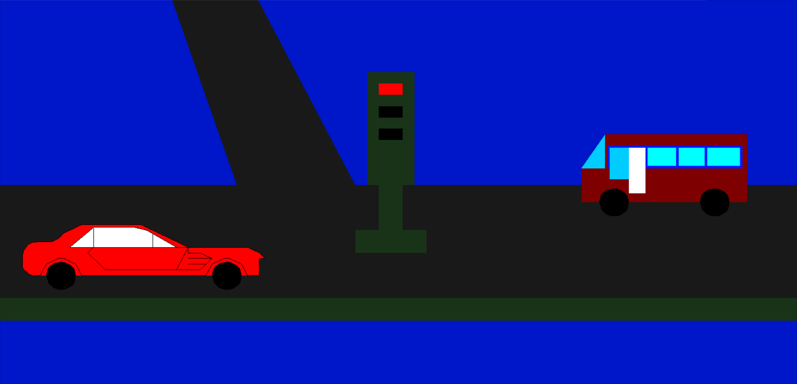

# Traffic-Signals
Mini Project on Graphical Representation of Traffic Signals Using OpenGL

# Project Description
Through this project I would like to showing Graphical Representation of Traffic Signals Using OpenGL

- First I Show the cntrol system,
- Then show the roads, bus,cars and signal lights,
- Finally show the control system of the project

# System Usuages

- Code Blocks
- OpenGL Primitives

# How to Install and Run the Project

1. Download & Install GLUT
2. Download main.cpp file
3. Run on Codeblocks

# Output

# Video Explanation

Explainer Video On Youtube: [Visit This Link](https://youtu.be/b25_25YnZ2Y)

